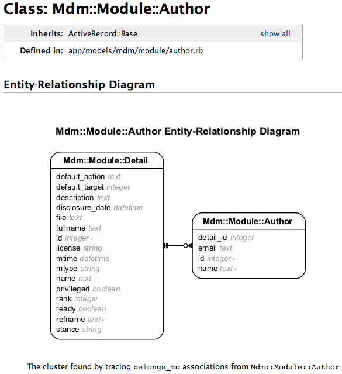
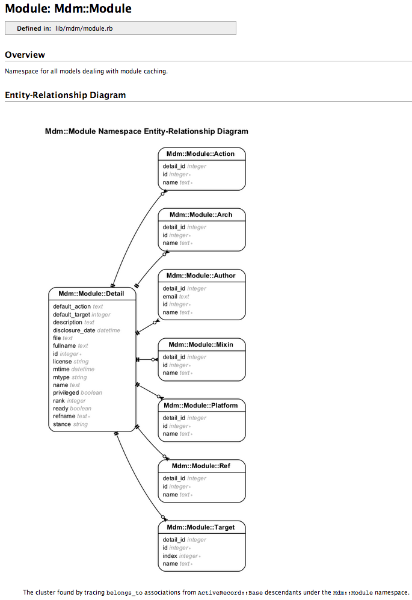

# YARD::Metasploit::ERD 

`yard-metasploit-erd` is a [YARD](yardoc.org) plugin that automatically inserts an "Entity-Relationship Diagram"
subsection containing a PNG Entity-Relationship Diagram for the entire schema (on the index page), for each Module that
contains `ActiveRecord::Base` subclasses and for each `ActiveRecord::Base` subclass.

For namespace Modules, the diagrams are restricted to the `ActiveRecord::Base` subclasses in that namespace and the
transitive closure of those classes `belongs_to` relationships.

For `ActiveRecord::Base` subclasses the diagram is restricted to the transitive closure of its `belongs_to`
relationships.

Using the `belongs_to` transitive closure means that all foreign keys are mapped to primary keys, so any diagram's
namespace or class could be extracted to another gem without leaving dangling foreign keys.

## Versioning

`YARD::Metasploit::ERD` is versioned using [semantic versioning 2.0](http://semver.org/spec/v2.0.0.html).  Each branch
should set `YARD::Metasploit::ERD::Version::PRERELEASE` to the branch name, while master should have no `PRERELEASE`
and the `PRERELEASE` section of `YARD::Metasploit::ERD::VERSION` does not exist.

## Installation

Add this line to your application's `Gemfile`:

    gem 'yard-metasploit-erd'

And then execute:

    $ bundle

Or install it yourself as:

    $ gem install yard-metasploit-erd

## Usage

Add this line to your application's `.yardopts`

    --plugin yard-metasploit-erd

Ensure your `ActiveRecord::Base` subclasses are loaded when YARD runs by eager loading before the `yard:doc` task runs:

    # lib/tasks/yard.rake
    task 'yard:doc' => :eager_load

    task eager_load: :environment do
      Rails.application.eager_load!
    end

## Contributing

1. Fork it ( https://github.com/`<my-github-username>`/yard-metasploit-erd/fork )
2. Create your feature branch (`git checkout -b my-new-feature`)
3. Commit your changes (`git commit -am 'Add some feature'`)
4. Push to the branch (`git push origin my-new-feature`)
5. Create new Pull Request
